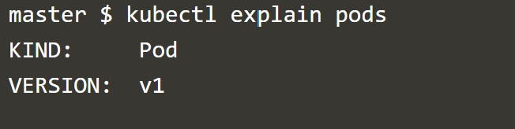

# Create pod using Declarative way 

## Prints out ready-made YAML

Copy and paste the following command with your podname to print the YAML file   `kubectl run podname --image=nginx --dry-run=client -o yaml`{{copy}}.

## Output YAML to file

Copy and paste the following command with your podname to output the YAML to a file in order to edit it.  `kubectl run podname --image=nginx --dry-run=client -o yaml > mypod.yaml`{{copy}}.

## Open in editor

 `mypod.yaml`{{open}}.

 ## Get the API Version and Kind for any Kubernetes Object 

 `kubectl explain pods`{{execute}}.

 If you scroll up to the top, the output you should be seeing is something like this: 

## Apply the modified yaml file 

`kubectl apply -f mypod.yaml`{{execute}}.
